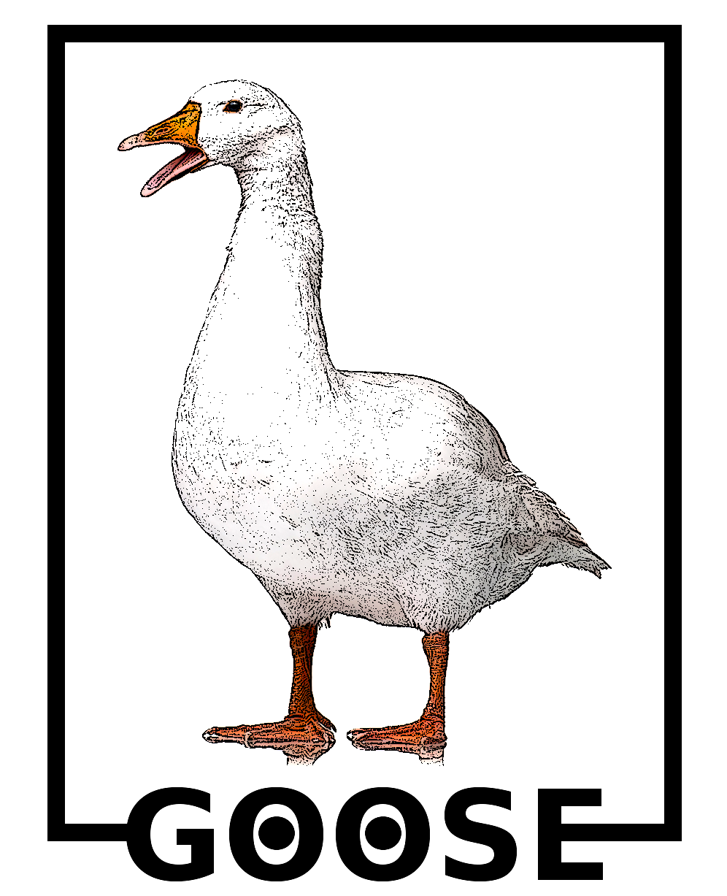

A framework for DNA sequence analysis and manipulation.

To install on Linux:
<pre>
git clone https://github.com/pratas/goose.git
cd goose/src/
make
</pre>

Included programs:
<pre>
  [+] goose-char2line
  [+] goose-comparativemap
  [+] goose-count
  [+] goose-extract
  [+] goose-extractreadbypattern
  [+] goose-fasta2seq
  [+] goose-fastaextract
  [+] goose-fastainfo
  [+] goose-fastq2fasta
  [+] goose-fastq2mfasta
  [+] goose-fastqclustreads
  [+] goose-fastqexcluden
  [+] goose-fastqmaximumreadsize
  [+] goose-fastqminimumreadsize
  [+] goose-fastqpack
  [+] goose-fastqsimulation
  [+] goose-fastqtrimm
  [+] goose-fastqunpack
  [+] goose-filter
  [+] goose-findnpos
  [+] goose-geco
  [+] goose-gede
  [+] goose-genrandomdna
  [+] goose-getunique
  [+] goose-info
  [+] goose-max
  [+] goose-mfmotifcoords
  [+] goose-min
  [+] goose-minus
  [+] goose-mutatedna
  [+] goose-mutatefasta
  [+] goose-mutatefastq
  [+] goose-newlineonnewx
  [+] goose-period
  [+] goose-permuteseqbyblocks
  [+] goose-randfastaextrachars
  [+] goose-randfastqextrachars
  [+] goose-randseqextrachars
  [+] goose-real2binthreshold
  [+] goose-reducematrixbythreshold
  [+] goose-renamehumanheaders
  [+] goose-reverse
  [+] goose-reverselm
  [+] goose-searchphash
  [+] goose-segment
  [+] goose-seq2fasta
  [+] goose-seq2fastq
  [+] goose-splitreads
  [+] goose-sum
  [+] goose-wsearch
</pre>

GOOSE provides pipes support for easy integration with current pipelines.

Moreover, there are many scripts to download sequences, shuffle, etc.

